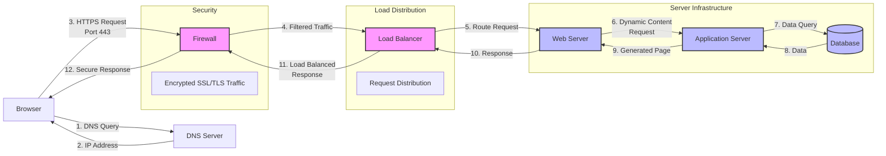

# System Flow Diagram: Google.com Request

This diagram illustrates the complete flow of a request to www.google.com:

1. **DNS Resolution**: Browser queries DNS server to convert domain to IP
2. **Firewall**: Secure traffic filtering on port 443
3. **Load Balancer**: Distributes incoming requests
4. **Web & Application Servers**: Process the request
5. **Database**: Stores and retrieves data

The entire communication is encrypted using HTTPS/SSL, represented by secure connections through the firewall.