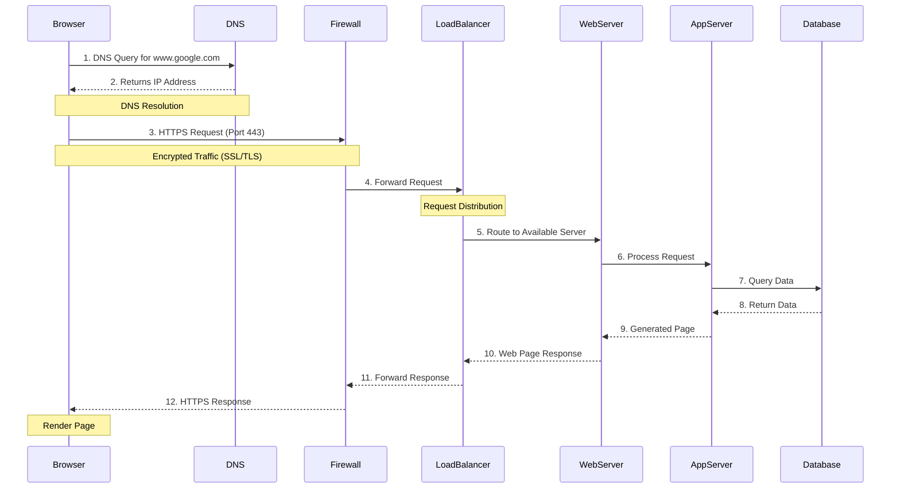

# What Happens When You Type google.com

This project explains the complete flow of what happens when you type https://www.google.com in your browser and press Enter.

## Flow Diagram

## Components Overview

1. **DNS Resolution**
   - Converts www.google.com to IP address
   - Involves DNS recursive resolvers and authoritative servers

2. **HTTPS/SSL**
   - Encrypted connection on port 443
   - TLS handshake for secure communication

3. **Firewall**
   - Filters incoming/outgoing traffic
   - Enforces security policies

4. **Load Balancer**
   - Distributes traffic across servers
   - Ensures high availability

5. **Web Server**
   - Handles HTTP requests
   - Serves static content

6. **Application Server**
   - Processes dynamic requests
   - Implements business logic

7. **Database**
   - Stores and retrieves data
   - Handles queries from app server